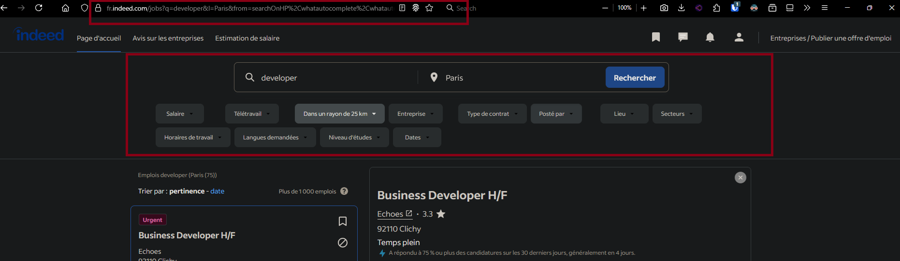

# Indeed Auto-Apply Bot

**WARNING:**  
This guide explains how to use this bot. Use at your own risk. Indeed may change their website or introduce new protections (such as captchas or anti-bot measures) at any time, which could break this tool or result in your account being restricted. This is for educational purposes only.

---

## Features

- Automatically finds and applies to jobs on Indeed with "Indeed Apply" .
- Uses Camoufox for browser automation (bypass Cloudfare, Captch bot)
- Handles multi-step application forms, including resume upload and personal info.

## Prerequisites

- Python 3.8+
- [Camoufox](https://github.com/meteor314/camoufox) installed and configured
- An Indeed account with:
  - Your CV already uploaded
  - Your name, address, and phone number filled in your Indeed profile

---

## Setup

1. **Clone this repository** and install dependencies:
    ```bash
    pip install -r requirements.txt
    ```

2. **Edit `config.yaml`:**

    Example:
    ```yaml
    camoufox:
      user_data_dir: "user_data_dir" # by default, no need to change this value
      language: "fr"  # or "uk", "de", etc. make sure to update this value

    search:
      base_url: "https://fr.indeed.com/jobs?q=python+developer&l=Paris"
      start: 0
      end: 100
    ```

    - `user_data_dir`: Path to your Chrome user data directory (to keep your Indeed session).
    - `language`: Your Indeed site language code (e.g., "fr" for France, "uk" for United Kingdom) etc..
    - `base_url`: The Indeed search URL for your job search.
    - `start`/`end`: Pagination range (should be multiples of 10).

3. **How to get your `base_url`:**

    - Go to [Indeed](https://www.indeed.com/) in your browser.
    - Select your search options (job title, location, remote working, type of work, etc.).
    - Click on **Find jobs**.
    - Copy the URL from your browser's address bar.
    - Paste this URL as the value for `base_url` in your `config.yaml`.

    

4. **Upload your CV to Indeed:**
    - Go to your Indeed profile and upload your CV.
    - Make sure your name, address, and phone number are filled in. 
    - This bot will use this information to apply for jobs. So make sure they are filled in correctly otherwise the bot will not be able to apply for jobs.

---

## First Run

1. **Login to Indeed manually:**
    - Run the bot:
      ```bash
      python indeed_bot.py
      ```
    - If not logged in, the bot will open Indeed and prompt you to log in manually.
    - After logging in, close the bot and restart it.

2. **Run the bot again:**
    - The bot will now use your saved session to search and apply for jobs. 
    - All your session data (cookies, login info) will be preserved in the `user_data_dir` specified in `config.yaml`.


## Usage

- The bot will:
  - Visit each search results page.
  - Collect all jobs with "Indeed Apply".
  - For each job:
    - Open the job page in a new tab.
    - Click "Apply" or "Postuler maintenant".
    - Step through the application wizard, selecting your uploaded CV and clicking "Continue"/"Submit".
    - Log the result in `indeed_apply.log`.


## Notes & Limitations

- This bot only works for jobs with "Indeed Apply" (Candidature simplifiée).
- If you encounter captchas or anti-bot protections, this bot should handle them automatically, but you may need to solve them manually.
- Indeed may change their website at any time, which could break this bot.
- Use responsibly and do not spam applications.
- This program is a guide on how to automate job applications,  you need to make some modifications to the code to make it work for your needs.

---

## Troubleshooting

- If the bot gets stuck or fails to apply:
  - Check `indeed_apply.log` for errors.
  - Make sure your CV and personal info are uploaded to Indeed.
  - Try increasing wait times if your internet is slow.

---

## Disclaimer

This project is not affiliated with Indeed. Use at your own risk.

## License
This project is licensed under the MIT License. See the [LICENSE](LICENSE) file for details