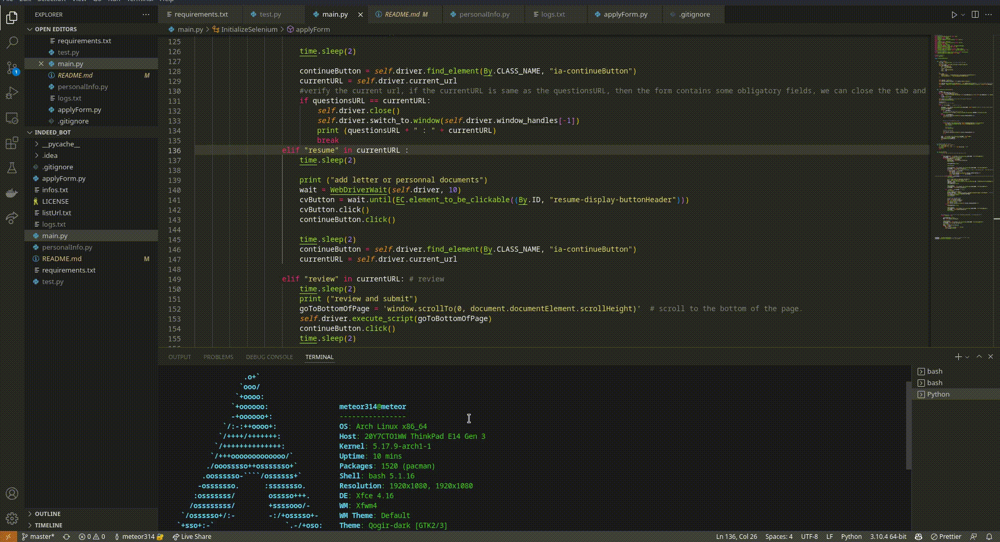

<div align="center">  <h1 style="font-size:30px" >indeed-bot <br />  
 </h1>  </div>  
<p align="center">a tool that applies for you.  
</p>  


### How does this work?

This is a python script. It scape indeed.com a and and depending on your chosen parameters, he will be able to apply for you

## Requirements

* **selenium**
* **chromedriver or firefox driver**
* **pip and python3**

If you have aldreay pip installed,  you can just copy and paste this commad :

## Installation

```sh
pip install -r requirements.txt
```

# Configuration ?

You need to configure search options for your profile. You can change this variable directly in main.py.

```python
self.searchOptions = 
{  
     "q" : "informatique", # domain of search 
     "l" : "Paris", # Area, For exemple Paris, France 
     "start" : 0, 
     # starting page, by default one page contains 10 jobs 
     "jt" : "apprenticeship", # type of job, trainee, apprenticeship etc... 
     "end" : 100       
 }  
```

You also need to define your chrome executable and path access. You can find all this information here : **chrome://version**


```python
self.paths = {  
 "profile_path" : "/home/meteor314/.config/google-chrome/Profile 4", 
 "binary_location" :  "/opt/google/chrome/google-chrome-stable", 
 }  
```

***If you launch it for first time, just make sure you 're already connected, don't forget to add your CV on your profile indeed.***

You can find all logs where the bots applies in logs files.

## Issue
If you're getting error like this :  there is an instance of chrome is open. You have to **quit** chrome and then restart the program.
```sh
  File "/home/meteor314/Desktop/indeed_bot/main.py", line 236, in <module>
    IndeedBot.initialize_selenium() # call the method
  File "/home/meteor314/Desktop/indeed_bot/main.py", line 91, in initialize_selenium
    self.driver.get(listURL[0]) # go to the first link of the list
  File "/home/meteor314/.local/lib/python3.10/site-packages/selenium/webdriver/remote/webdriver.py", line 442, in get
    self.execute(Command.GET, {'url': url})
  File "/home/meteor314/.local/lib/python3.10/site-packages/selenium/webdriver/remote/webdriver.py", line 430, in execute
    self.error_handler.check_response(response)
  File "/home/meteor314/.local/lib/python3.10/site-packages/selenium/webdriver/remote/errorhandler.py", line 247, in check_response
    raise exception_class(message, screen, stacktrace)
selenium.common.exceptions.WebDriverException: Message: unknown error: unexpected command response
  (Session info: chrome=103.0.5060.53)
Stacktrace:
#0 0x561c999ffb13 <unknown>
```

For more information, you can visit this github issue :
[https://github.com/SeleniumHQ/selenium/issues/10799](https://github.com/SeleniumHQ/selenium/issues/10799)


## License

This project is licensed under [MIT](https://raw.githubusercontent.com/meteor314/indeed_bot/master/LICENSE).

### Alert

I am not responsible if your account is banned, you are responsible for your account. The developers of this bot are not responsible for its misuse

#### If you encounter a bug, don't hesitate to open an issue, and any help will be welcome ^_^

Many thanks to [@dalek63](https://github.com/dalek63) for his help, without help, this project would never have got off the ground.
